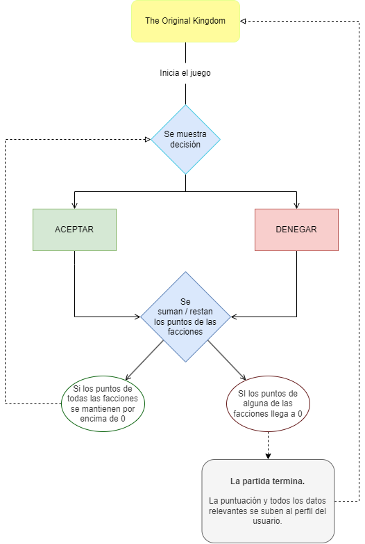

## 🏰 Descripción general del proyecto:

"The Original Kingdom" es un juego de simulación de toma de decisiones en el que los jugadores asumen el papel de un rey medieval. El objetivo del juego es tomar decisiones estratégicas para mantener el equilibrio y la prosperidad en el reino durante el mayor tiempo posible.

# Árbol de decisiones

## 📂 Arquitectura y estructura del proyecto:

El proyecto se divide en dos partes principales:

### 🤖 Backend:
- Se encarga de manejar los controladores, las rutas de las peticiones y los esquemas de los modelos de datos.
- Utiliza Node.js con Express para gestionar las rutas y las solicitudes HTTP.

### 🙍‍♂️ Frontend:
- Utiliza Node.js con React para la creación del frontend del juego.
- El directorio "public" almacena el archivo index.html y otros recursos como imágenes y videos.
- Se hace uso de los estados de React (UseState) para el manejo de la lógica del juego.

## ⚙ Funcionalidades principales:

El juego incluye las siguientes características principales:
- Sistema de registro e inicio de sesión utilizando **hash** para almacenar de forma segura las contraseñas de los usuarios.
- Sistema de manejo de volumen para controlar el sonido del juego.
- Toma de decisiones estratégicas que afectan a diferentes facciones del reino, como la economía, la protección, la población, etc.
- Sistema de puntos en el cual se actualizara el *maxscore* en la base de datos si el usuario supero su mayor puntuacion.

## 📚 Documentación técnica:

El proyecto fue desarrollado utilizando las siguientes tecnologías:
- Backend: Node.js con Express para el servidor, MongoDB Atlas como base de datos.
- Frontend: React para la interfaz de usuario.
- HTML, JavaScript para el desarrollo web.
- Se utiliza la función UseState de React para el manejo de estados en el frontend.

## 🌐 Endpoints de la API:

Se proporcionan las siguientes rutas de API para las peticiones al backend:

### 👥 Usuarios:
- POST /api/user/register -> Registro de nuevos usuarios.
- GET /api/user/data/:email -> Obtener datos de un usuario específico.
- PATCH /api/user/update/:email -> Actualizar datos de un usuario.
- DELETE /api/user/delete/:email -> Eliminar un usuario.

### ⚖ Decisiones:
- POST /api/decision/create -> Crear una nueva decisión.
- GET /api/decision/randomDecision -> Obtener una decisión aleatoria.
- GET /api/decision/data -> Obtener detalles de una ID específica.

## 📑 Instrucciones de instalación, configuración e instrucciones de uso:

Para instalar y ejecutar el proyecto:
1. Ejecutar `npm install` para instalar las dependencias.

2. Lanzar el proyecto:
    - Opción 1: Ejecutar `docker-compose up` para utilizar Docker.
    - Opción 2: Ejecutar `npm start` en la carpeta backend y despues en la carpeta frontend respectivamente.

3. Asegurarse de que el backend se inicie primero para ocupar el puerto 3000 y luego iniciar el frontend en el puerto 3001.
